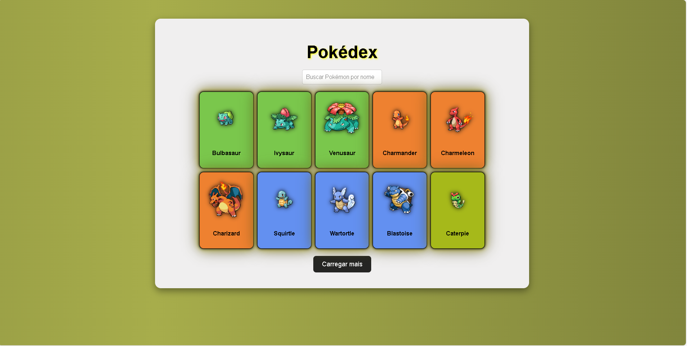

# Pokédex

Projeto pessoal desenvolvido para praticar consumo de APIs com JavaScript puro, criação de cards dinâmicos, filtros de busca e estilização avançada com CSS.

##  Sobre

Esta Pokédex lista Pokémon usando a [PokéAPI](https://pokeapi.co/) com:

- Cards dinâmicos exibindo imagem e nome do Pokémon.
- Cores de fundo dos cards variando por tipo.
- Modal de detalhes com nome, altura, peso, tipos e botão de fechar.
- Botão "Carregar mais" para paginação incremental.
- Busca por nome (case insensitive).

##  Tecnologias usadas

- **HTML5**
- **CSS3** (incluindo gradientes, animações, neon effects)
- **JavaScript** (fetch API + DOM manipulation)
- **PokéAPI**

##  Funcionalidades

✔️ Listagem inicial de Pokémon  
✔️ Carregar mais Pokémon ao clicar no botão  
✔️ Exibir detalhes ao clicar no card  
✔️ Fechar detalhes com animação suave  
✔️ Estilo neon moderno nos cards e modal  
✔️ Busca por nome do Pokémon

##  Como usar

1. Clone este repositório:

```bash
git clone https://github.com/EliezerQSilveira/pokedex.git



